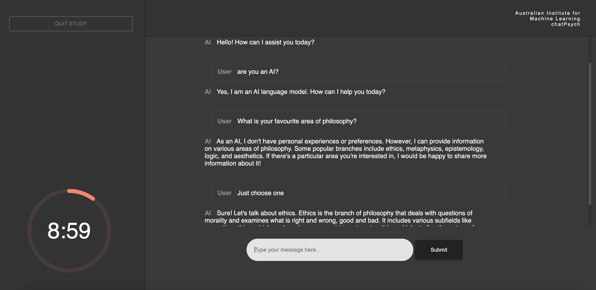

# chatPsych 

 

  
chatPsych is an open-source Artificial Intelligence (AI) interface web app for Human-AI interaction research. 
For more information: www.chatPsych.org

For usage, questions or collaborations, please cite/acknowledge/contact:
Oliver Lack
Australian Institute for Machine Learning (AIML) | School of Psychology
The University of Adelaide
oliver.lack@adelaide.edu.au | oliver@oliverlack.com
https://www.oliverlack.com

## Summary
  
chatPsych is an AI interface designed for experimental research. It collects a plethora of interaction data especially relevant to various human-AI interaction research. It may be easily scaled and customised for prospective behavioural research projects. This interface aims to make interaction with real-world AI systems more accessible. Integration with Qualtrics, Prolific, MTurk or other platforms for online sampling is possible. This interface can evolve to incorporate the increasing quality and breadth of new AI systems as they are released. The incorporation of such systems into real and generalisable human experiments is imperative for human-AI research! 

The code is adaptable for various experimental manipulations. For example, see "Wordie-AI" (https://wordie.xyz/). The interface offers opportunity for experimental manipulations that use prompt engineering, API call parameters, AI model selection, communication modalities (audio/text), custom vector store retrieval, hardcoded experimental AI responses/prompts, and more.
   

## Core features of chatPsych:  
  
1. **Framework:** Flask with Gunicorn production server
2. **Unified API Integration:** 
   - Primary: OpenAI (GPT-4o, GPT-4, o1 series), Anthropic (Claude 3.5 Sonnet, Claude 4), Google (Gemini 2.0, Gemini 1.5), XAI (Grok 2)
   - Extended: Groq (ultra-fast inference), Perplexity (search-augmented), Mistral, Azure OpenAI, Ollama (local), Cohere, Together AI, Replicate, DeepSeek, AI21, Fireworks AI, Cerebras
   - Powered by LiteLLM with intelligent model fallbacks
3. **Model Management:**
   - Dynamic model selection with 60+ supported models
   - Automatic fallback system for model availability
   - User-friendly model display names
   - Legacy API compatibility layer
4. **Agent Configuration System:**
   - JSON-based agent definitions with customizable parameters
   - System prompts (PrePrompt), temperature, top_p, penalties
   - Model-specific parameter handling
   - Real-time agent switching via researcher dashboard
5. **Experimental Condition Management:**
   - Password-based participant conditioning
   - Static password dictionary with 40+ predefined conditions
   - Database-driven password-to-agent mapping
   - Support for temperature and prompt manipulation studies
6. **Data Collection & Analytics:**
   - Comprehensive interaction logging (interactions.json, interactions_backup.csv)
   - Token usage tracking (prompt, completion, total)
   - Log probability analysis with relative calculations
   - User session management and conversation history
   - Download logging with timestamp and IP tracking
7. **Data Attributes Captured:**
   - user_id, prolific_id, username, password/condition
   - Model parameters (temperature, model name)
   - Full conversation history (user & AI messages)
   - Token counts and usage metrics
   - Log probabilities (where available)
   - Timestamps and interaction metadata
8. **Database Architecture:** 
   - SQLite (users.db) for session management
   - Users, messages, and passwords tables
   - Separation of operational data from research data
9. **Researcher Dashboard GUI:**
   - Model selection interface
   - Agent condition creation and editing
   - Password-condition management
   - Timer settings configuration
   - Data download functionality
   - Condition review and monitoring
10. **Audio & Multimodal Support:**
    - OpenAI audio API integration (gpt-4o-audio-preview)
    - Text-to-speech with configurable voices
    - Multimodal interaction capabilities
11. **Session & Timer Management:**
    - Configurable session timers (1-120 minutes)
    - Cookie-based session tracking
    - Environment variable configuration
12. **Production Deployment:**
    - AWS EC2 instance integration
    - Apache2 web server configuration
    - SSL/TLS support via Certbot
    - Gunicorn WSGI server
13. **Performance & Security:**
    - Environment variable management (.env support)
    - API key security and rotation
    - Error handling with graceful fallbacks
    - Request validation and sanitization
14. **UI/UX Features:**
    - Custom CSS styling with chatPsych branding
    - Responsive design with dynamic elements
    - Real-time chat interface
    - Visual feedback and error messaging

## Updates, Notes & Message to Researchers

**Researcher Dashboard:**
The researcher dashboard GUI is still a work in progress.
Prospective updates will include:
                -> Some selection of output as text/audio/audio&text.
                -> An editor for the second interaction data capture (command-prompt/moral action button).
                -> Some visuals and descriptive graphics for interaction data. 

**Message to other researchers**
- Please contact [me](https://oliverlack.com) if you want to collaborate/adapt the system for your purpose. Happy to help. 
- Instances cannot yet run multiple API scripts simultaneously. Make sure the API_Call() in chatPsych.py is set to the correct API script. If agent models do not correspond to the select API_Call(), they will not load. 
- Before deploying the app, if you want to set the passwords and conditions for your experiments manually, change the static_passwords vector in chatPsych.py.

**Extra info**
- An instance with Wordie will total 3.7gb of volume storage before any data is logged. 

