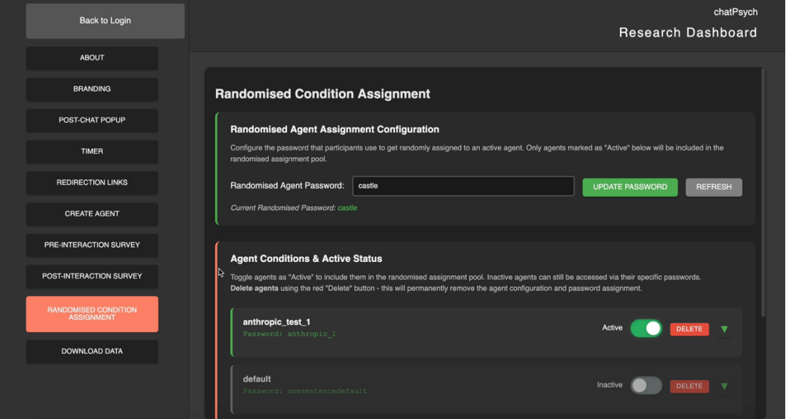

# chatPsych
  
chatPsych is an open-source Artificial Intelligence (AI) interface web app for Human-AI interaction research. 
  For more information: www.chatPsych.org

 

 

For usage, questions or collaborations, please cite/acknowledge/contact:
 
 Oliver Lack
 Australian Institute for Machine Learning (AIML) | School of Psychology
 The University of Adelaide
 oliver.lack@adelaide.edu.au | oliver@oliverlack.com
 https://www.oliverlack.com

## Summary
  
chatPsych is a Python based, open-source interface for human–AI research. It leverages widespread AI models and aims to improve the quality of research in HCI/HRI by offering an easily accessible tool for novel experiments with AI systems.
 
 
The codebase offers pre/post survey programming, randomisation of AI agent conditions, and various data collection points beyond user input prompts and model token outputs. The developer hopes to encourage science that reaches beyond restricted survey designs, fake stimuli, wizard of oz manipulations, or mere verbal-responses to ungeneralisable observations. chatPsych aims to encourage real interactions with real AI systems.
 
 
chatPsych facilitates collection of a plethora of interaction data especially relevant to various human-AI interaction research. It may be easily scaled and customised for prospective behavioural research projects. Stimulus representativeness and psychological realism in relation to real-world AI systems is emphasised.
 
 
This interface offers a method for experimental designs that require prompt engineering, manipulating model hyperparameters, basic model comparison, content moderation, and more. The incorporation of widely used AI systems into generalisable experiments is imperative for human-AI research!

## Core features of chatPsych:  
  
1. **Framework:** Flask with Gunicorn production server on apache2/nginx. Containerised with Docker.
2. **Unified API Integration:** 
   - Primary: OpenAI (GPT-4o, GPT-4, o1 series), Anthropic (Claude 3.5 Sonnet, Claude 4), Google (Gemini 2.0, Gemini 1.5), XAI (Grok 2)
   - Extended: Groq (ultra-fast inference), Perplexity (search-augmented), Mistral, Azure OpenAI, Ollama (local), Cohere, Together AI, Replicate, DeepSeek, AI21, Fireworks AI, Cerebras
   - Powered by LiteLLM with intelligent model fallbacks
3. **Model Management:**
   - Dynamic model selection with 60+ supported models
   - Automatic fallback system for model availability
   - User-friendly model display names
   - Legacy API compatibility layer
4. **Agent Configuration System:**
   - JSON-based agent definitions with customizable parameters
   - System prompts (PrePrompt), temperature, top_p, penalties
   - Model-specific parameter handling
   - Real-time agent switching via researcher dashboard
5. **Experimental Condition Management:**
   - Password-based participant conditioning
   - Static password dictionary with 40+ predefined conditions
   - Database-driven password-to-agent mapping
   - Support for temperature and prompt manipulation studies
6. **Data Collection & Analytics:**
   - Comprehensive interaction logging (interactions.json, interactions_backup.csv)
   - Token usage tracking (prompt, completion, total)
   - Log probability analysis with relative calculations
   - User session management and conversation history
   - Download logging with timestamp and IP tracking
7. **Data Captured:**
   - user_id, prolific_id, username, password/condition
   - Model parameters (temperature, model name)
   - Full conversation history (user & AI messages)
   - Token counts and usage metrics
   - Log probabilities (where available)
   - Timestamps and interaction metadata
8. **Database Architecture:** 
   - SQLite (users.db) for session management
   - Users, messages, and passwords tables
   - Separation of operational data from research data
9. **Researcher Dashboard GUI:**
   - Model selection interface
   - Agent condition creation and editing
   - Password-condition management
   - Timer settings configuration
   - Local Data download functionality
   - Condition review and monitoring
10. **Session & Timer Management:**
    - Configurable session timers
    - Cookie-based session tracking
12. **Preferred Production Deployment:**
    - AWS EC2 instance integration
    - Apache2/Nginx web server configuration
    - SSL/TLS support via Certbot
    - Gunicorn WSGI server

## Updates, Notes & Message to Researchers

**Prospective updates will include:**
-> Text-audio api integration and graphics
-> MCP integration (e.g., RAG, CAG, and web-search)
-> Image output integration for multi-modal models

**Message to other researchers**
- Please contact [me](https://oliverlack.com) if you want to collaborate/adapt the system for your purpose. Happy to help. 
- Instances cannot yet run multiple API scripts simultaneously. Make sure the API_Call() in chatPsych.py is set to the correct API script. If agent models do not correspond to the select API_Call(), they will not load. 
- Before deploying the app, if you want to set the passwords and conditions for your experiments manually, change the static_passwords vector in chatPsych.py.
- An instance with Wordie will total around 5gb of volume storage before any data is logged. 
- IMPORTANT: The survey data files will be messed up if you run multiple different surveys per deployment. 
To save errors in column names in your data files, make sure to only setup one survey configuration per deployment. 

